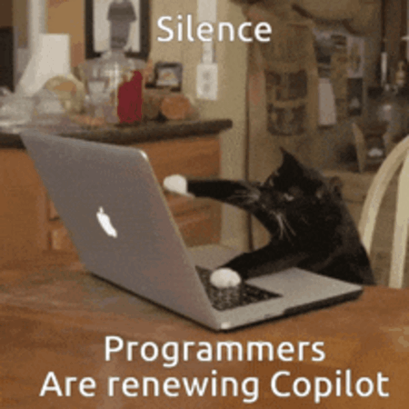

  

<h2>Sobre mim:</h2>

Me chamo Matheus, sou estagiário em Análise de Dados na TATA Consultancy Services (TCS), onde participo do Bootcamp 2X2Y em Londrina. Neste programa, estou sendo capacitado para a área de Analytics abrangendo tecnologias como <code>Python</code>; <code>Pandas</code> (para tratamento otimizado de dados); <code>Matplotlib</code> e <code>Seaborn</code> (para criação e visualizaçáo de gráficos); bancos de dados relacionais (com <code>SQLite</code>); e <code>Streamlit</code> usando princípios de <code>UI/UX</code> (para criação de dashboards interativos voltados a experiência do usuário).  Possuo background em tecnologias Front-end e Back-end, sendo elas: <code>HTML5</code> • <code>CSS3</code> • <code>JavaSCprit</code> • <code>Node.js</code> • <code>C</code> • <code>Git</code>. Sempre valorizando boas práticas de desenvolvimento como <code>Clean Code</code> e <code>Conventional Commits</code>.  Sinta-se a vontade e dê uma olhadinha em minha trajetória!

 

  

<h2 align="left">Tecnologias e linguagens:</h2>

<h3>Quais eu mais utilizo:</h3>

  

<h2>WakaTime Status - VS Code</h2>

  

<h2 align="left">Conecte-se comigo:</h2>

Se você gostou da minha jornada ou tem interesse em trocar figurinhas sobre tecnologia, não hesite em entrar em contato.

  
  
  
  

